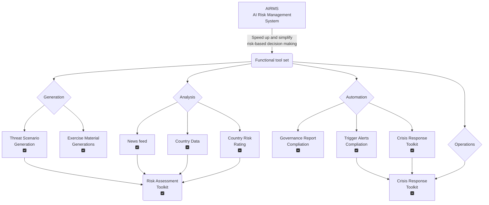
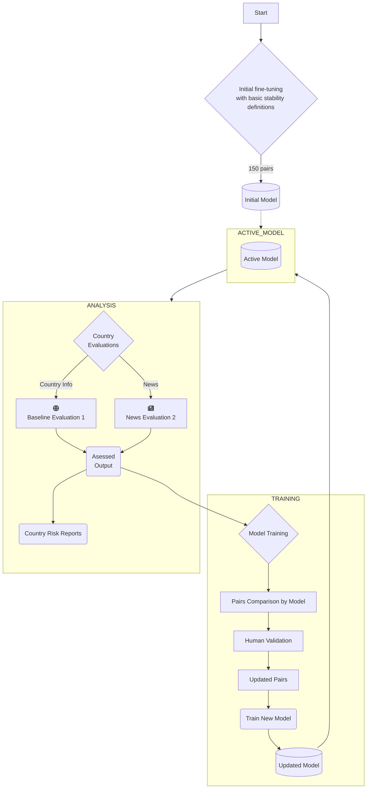

*This project is still active but this webpage is sadly neglected*

# The AIRMS Project
A project to build an interactive risk manager (AI risk management system) using desktop tools assisted by LLMS and agents. The intent is to provide on-demand data and support for risk managers. Capabilities must include:

- [x] **RAT** General guidance on risk and crisis management to answer theoretical queries or questions *(Compelted as stand-alone bot)*
- [x] **OX** A risk assessment assistant to help assess the risks associated with threats *(build - DCDR.io)*
- [ ] **RABBIT** General country information *(prototype built)*
- [ ] **DRAGON** Updated country news *(prototype built)*
- [ ] **SNAKE** Crisis planning tools *(mostly built)*
- [ ] **HORSE** Reporting and governance reminders and prompts *(built as part of DCDR)*
- [ ] **GOAT** Is the integration requirement

[The project roadmap is here](https://github.com/users/agsheves/projects/1)

---
### System Overview

Here's a sketch of how the components will fit together

---
### Model Training

This is the next big step which requires careful design. The intent is to get the model to rationalize or explain the reasons for each rating or classification. This will:
- Allow users to see why a decision has been made. In turn they can agree / disagree / utilize the explanation in their decision-making. Explaining why an AI tool made an assessment will become an increasingly important part of governance and audits.
- Provide additional pairs for further training. The model analysis can be reviewed again the initial pairs and a human SME's judgement. The updated pairs will be more accurate and numerous, improving the quality of future models.

[ ] More research on the best practices for model training and reinforcement

---

## Status as at Thursday, September 7, 2023 

### RAT
*General guidance on risk and crisis management to answer theoretical queries or questions*

**Status** - ✅ 
 - A stand is the first demo of a riskbot from June 2023. The bot runs in [botpress](https://botpress.com/) and there is a demo [here](https://agsheves.github.io/riskbot/). This version used my books (Beyond The Spreadsheet and the risk management system build handbook) as data sets. As a fallback, the model would pass the request to ChatGTP if the model returned the answer 'I don't know' from a search of the built-in datasets.
 - This chatbot has been integrated into the DCDR and CrisisDojo tools and woks reasonably well and consistently. See the bot on [CrisisDojo here](https://crisisdjo.ai)

---

### OX
*A risk assessment assistant to help assess the risks associated with threats*

**Status** - ✅ *as standalone tool*
- Built and deployed in [DCDR](dcdr.io)

---

### RABBIT
*General country information*

- In progress. Prototype [here](https://countryassessments.anvil.app/) and [overview video here](https://youtu.be/BYvwZEbwzxM0)

---

### DRAGON
*Updated country news*

- In progress.
- See the progress in the repository [here](https://github.com/agsheves/daily-news-summary)

---

### SNAKE
*Crisis planning tools*

**Status** - ✅ *as standalone tool*
 - CrisisDojo tools work reasonably well and consistently. See the tools on the [CrisisDojo app here](https://app.crisisdjo.ai)

 ---

### HORSE
*Reporting and governance reminders and prompts*

**Status** - ✅ *as standalone tool*
- Embedded within DCDR

---

### GOAT
*Integration*

